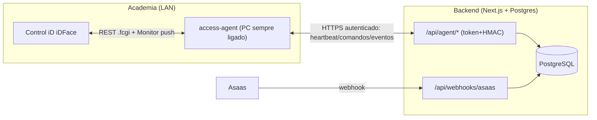
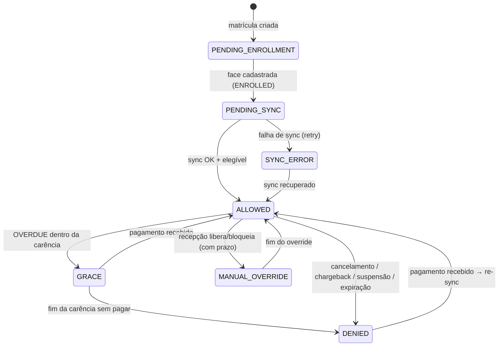
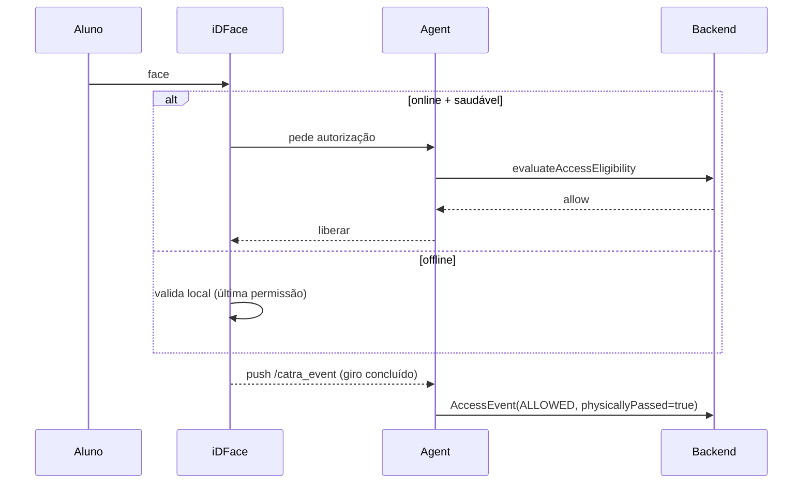
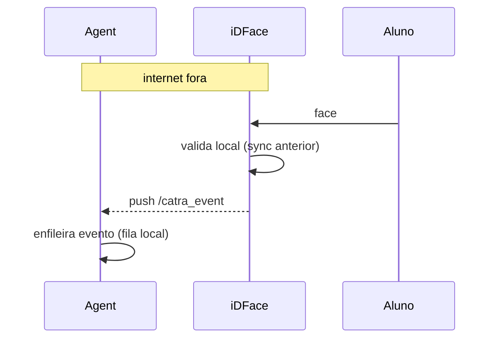
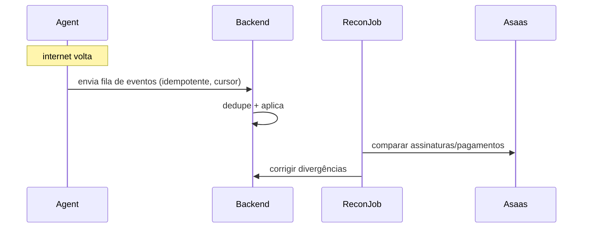
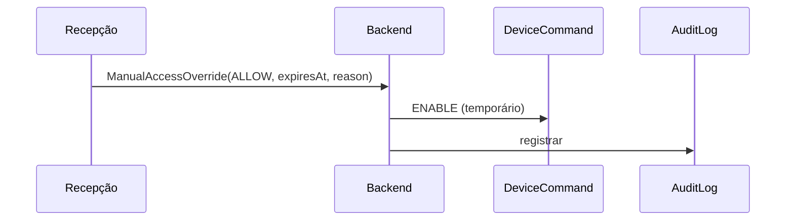
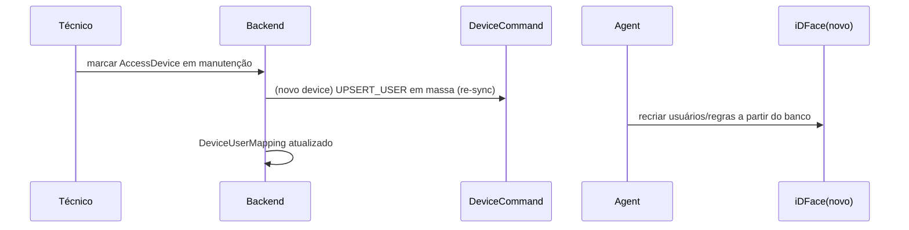

# Integração de Catraca Biométrica (Control iD iDFace) — Design

**Data:** 2026-07-06
**Projeto:** Coliseu CRM — Academia Coliseu Team
**Status:** Design para aprovação (não implementar antes da 2ª aprovação, após o plano)

## Objetivo

Integrar, de ponta a ponta: cadastro/matrícula → assinatura e cobrança recorrente
Asaas → status financeiro e contratual → catraca física com reconhecimento facial
(**Control iD iDFace**) → registro real de entradas e retenção → bloqueio/desbloqueio
automático de acesso. O backend é a fonte de verdade comercial; um serviço local
(`access-agent`) faz a ponte segura com o equipamento na LAN.

---

## 1. Diagnóstico confirmado (por inspeção do código)

| # | Ponto | Evidência |
|---|-------|-----------|
| 1 | Store em memória via `globalThis` | `src/lib/store.ts`: `g.__coliseuDB ??= {...}` |
| 2 | Dados perdidos em restart real | idem; comentário "⚠️ O estado zera quando o servidor/container reinicia" |
| 3 | Sem banco de produção | Nenhum ORM/driver em `package.json` |
| 4 | Sem auth / RBAC | `/api/*` abertas, sem sessão/middleware |
| 5 | Webhook muta status direto em memória | `src/app/api/webhooks/asaas/route.ts` → `marcarCobrancaPaga/Atrasada` |
| 6 | Matrícula guarda só a 1ª cobrança | `store.matricularPessoa` cria uma `Cobranca` com o `asaasId` da 1ª cobrança |
| 7 | Cobranças recorrentes futuras terão IDs diferentes | Asaas gera `paymentId` novo por ciclo; não capturado |
| 8 | Sem idempotência de webhook | Não há `WebhookEvent`; reprocesso re-aplica efeito |
| 9 | `ultimaPresenca` vem da matrícula, não de passagem real | `matricularPessoa` seta `ultimaPresenca: agora` |
| 10 | Sem tabela de eventos de acesso | Inexistente |
| 11 | `/painel` lê mocks direto | `src/app/(app)/painel/page.tsx` importa `alunos/cobrancas/leads` de `mock-data` |
| 12 | Sem entidades de catraca/credencial/comando/sync/mapeamento | Inexistentes |

**Problemas adicionais encontrados:**
- `/painel` diverge do store (lê `mock-data` estático) — números não refletem o estado real.
- `Cobranca.status` e `Pessoa.status` acoplam cadastro+contrato+cobrança+acesso num só campo.
- Webhook casa `payment.id === cobranca.asaasId`; recorrências futuras nunca casam.
- Sem `externalReference` nos objetos Asaas → reconciliação impossível sem heurística.
- `billingType` fixo em PIX, mas sandbox devolveu BOLETO; modelo não guarda o tipo efetivo.
- Rotas `/api` sem rate-limit nem verificação de origem.

---

## 2. Decisões tomadas e pendentes

**Tomadas (nesta sessão de brainstorm):**
- **Hardware:** Control iD iDFace (facial; REST `.fcgi` na LAN; modos Standalone e Online; Monitor push).
- **Arquitetura:** **Híbrido** (Online quando agente/backend saudáveis; fallback para validação local sincronizada).
- **Tolerância:** carência configurável **3–5 dias** (default 5) após vencimento (status GRACE) → depois DENIED.
- **1º acesso:** **1 acesso de cortesia** antes do 1º pagamento (também cobre visitante/diária).
- **Credencial:** **face + cartão/PIN** (múltiplas `AccessCredential` por pessoa; alternativa não-biométrica p/ LGPD).
- **Unidades:** uma unidade agora, **schema multi-ready** (entidade `Unit` + FKs).
- **Persistência:** **Prisma + PostgreSQL**, migração gradual do `store.ts`.

**Pendentes (marcar e confirmar antes/durante a fase correspondente):**
- Valor exato da carência (3, 4 ou 5 dias) — default 5, configurável por unidade/plano.
- Regras finas de `AccessPolicy` por plano (janelas de horário, limite de entradas/dia).
- SLOs numéricos (latência de decisão local, cobertura de testes) — propostos na §14, a confirmar.
- Guardar `access_photo` das identificações? Proposta: **desligado por padrão** (LGPD).
- Frequência da reconciliação Asaas — proposta: diária + sob demanda.
- Auth agente↔backend: **token rotacionável + HMAC** no v1; mTLS como evolução.
- Alvo de deploy do backend em produção (hoje só docker-compose de dev).
- Consentimento de menores: fluxo de responsável legal — a definir com a operação.

---

## 3. Arquitetura — comparação e recomendação

| Alt. | Como funciona | Prós | Contras |
|---|---|---|---|
| **A · Standalone sincronizada** | Backend = verdade comercial; agente sincroniza usuários/faces/regras; device valida local | Offline OK; academia não para; simples | Decisão financeira reflete no próximo sync |
| **B · Online tempo real** | iDFace pergunta ao servidor a cada giro (modo Online nativo) | Decisão sempre fresca | Depende de LAN+agente+backend no instante; exige fallback (= Alt. A) |
| **C · Cloud → device direto** | Backend cloud acessa IP privado da catraca | — | **Rejeitada**: expõe device na internet, NAT/IP privado, superfície de ataque, sem offline |

**Recomendação (escolhida): Híbrido = A (fundação) + B (camada).** O iDFace opera Online
quando o agente está saudável e o backend responde rápido; **cai para Standalone local**
(permissões já sincronizadas) quando algo está fora. A base sempre sincronizada torna o
fallback seguro; por isso o sync é construído antes (Fase 3–4) e o online por cima (Fase 5).

**Por que não expor a catraca (Alt. C):** o Monitor do iDFace faz *push* para um
`hostname:port` na LAN; o device espera um servidor local. Expor o equipamento na internet
significa NAT/port-forward de um dispositivo de segurança, sem TLS mútuo nativo, sem
resiliência offline e com superfície de ataque inaceitável. O `access-agent` na LAN é o
endpoint do Monitor e a única ponte (autenticada) com o cloud.

**Topologia:**



### Fundamentos do Control iD iDFace (verificados na doc oficial)
- REST sobre Ethernet: `login.fcgi`/`do-login`, `load_objects.fcgi`, `create_objects.fcgi`,
  `modify_objects.fcgi`, `destroy_objects.fcgi`, `execute_actions.fcgi`, `set_configuration.fcgi`. Sessão por cookie.
- Objetos: `users`, `access_rules`, `groups`, `time_zones`, `access_logs`, `templates`, `user_images`, `cards`.
- **Monitor = push** (device → servidor LAN) via `set_configuration` (hostname/port/path, default `api/notifications`):
  `/dao` (mudanças em access_logs/templates/cards/alarmes), `/catra_event` (giro: esquerda/direita/abandono),
  `/device_is_alive` (heartbeat), `/user_image` `/template` `/card` `/pin` `/password` (enrollment remoto),
  `/operation_mode`, `/door`, `/access_photo`.
- Cadastro remoto síncrono/assíncrono (retorna template/foto em base64); até 10.000 faces; liveness.

> Nomes exatos de endpoints/campos serão confirmados contra o manual na Fase 0/5.

---

## 4. Persistência (Prisma + PostgreSQL) e migração gradual

- `src/lib/store.ts` vira **fachada** sobre `src/lib/repositories/*` (Prisma). Assinaturas das
  funções atuais preservadas (`listarPlanos`, `matricularPessoa`, `listarCobrancas`, etc.) →
  telas (Server Components) não mudam. O `globalThis` sai.
- `mock-data.ts` → `prisma/seed.ts` (seed determinístico; deixa de ser fonte em runtime).
- `/painel` passa a ler repositórios (corrige a divergência).
- O domínio de acesso **nasce em Postgres** (nunca `globalThis`).
- Runtime `nodejs` (default do Next 16) nas rotas que usam Prisma.

**Prisma vs Drizzle (justificativa):** escolhido Prisma por schema declarativo, migrations
geradas, client tipado maduro e melhor ergonomia para a migração incremental store→repositório
e para a equipe. Drizzle (SQL-first, mais leve) seria válido, mas exige mais boilerplate; a
automação do Prisma vence para este caso.

---

## 5. Modelo de dados

Convenção: todo id interno é `cuid`; toda tabela com escopo de operação carrega `unitId`.

### Núcleo / identidade & comercial
- **Unit** — unidade/filial. Finalidade: escopo multi-ready. Rel.: 1—N com quase tudo.
  Único: `slug`. Índice: `id`.
- **User** (admin) — operadores do sistema. Rel.: N—1 `Role`, N—1 `Unit`. Único: `email`.
- **Role** — RBAC (`ADMIN`, `RECEPCAO`, `TECNICO`). Único: `name`.
- **Person** — evolução de `Pessoa` (lead→aluno). Rel.: N—1 `Unit`, 1—N `Membership`,
  1—N `AccessCredential`, 1—1 `BillingCustomer`. Único: `cpf` (nullable), `codigo`.
  Índices: `(unitId, fase)`, `(nome)`.
- **Plan** — evolução de `Plano` (já migrado). Rel.: N—1 `Unit`, 1—N `Membership`, 1—N `AccessPolicy`.
  Índice: `(unitId, ativo)`.
- **Membership** — contrato do aluno (tira contrato de `Pessoa`). Campos: `planId`, `status`
  (MembershipStatus), `startAt`, `endAt`, `courtesyEntriesLeft` (default 1). Rel.: N—1 `Person`,
  N—1 `Plan`, 1—1 `BillingSubscription`. Índices: `(personId, status)`, `(status, endAt)`.
- **BillingCustomer** — espelho do customer Asaas. Campos: `asaasCustomerId`, `externalReference`.
  Único: `asaasCustomerId`. Rel.: 1—1 `Person`.
- **BillingSubscription** — assinatura Asaas. Campos: `asaasSubscriptionId`, `cycle`, `value`, `status`.
  Único: `asaasSubscriptionId`. Rel.: 1—1 `Membership`.
- **Payment** — cada cobrança da assinatura. Campos: `asaasPaymentId`, `billingType` efetivo,
  `value`, `dueDate`, `status` (BillingStatus), `paidAt`, `invoiceUrl`, `externalReference`.
  Único: `asaasPaymentId`. Índices: `(subscriptionId, dueDate)`, `(status)`.
- **WebhookEvent** — todo evento Asaas, idempotente. Campos: `asaasEventId`, `type`, `payload`
  (mínimo), `receivedAt`, `processedAt`, `processState`, `attempts`. Único: `asaasEventId`.
  Índice: `(processState, receivedAt)`.

### Domínio de acesso
- **AccessDevice** — cada iDFace. Campos: `unitId`, `name`, `lanHost`, `lanPort`, `firmware`,
  `mode` (STANDALONE/ONLINE/HYBRID), `lastHeartbeatAt`, `agentId`, `status`. Único: `(unitId, name)`.
  Índice: `(unitId, status)`.
- **AccessCredential** — credencial por pessoa (face/cartão/PIN). Campos: `personId`, `type`
  (FACE/CARD/PIN), `status` (EnrollmentStatus), `deviceRef` (id no device, **sem template bruto**),
  `enrolledAt`, `revokedAt`. Índice: `(personId, type)`.
- **DeviceUserMapping** — `Person ↔ user_id do device`. Campos: `deviceId`, `personId`,
  `externalUserId`, `syncStatus` (DeviceSyncStatus), `lastSyncAt`. Único: `(deviceId, externalUserId)`,
  `(deviceId, personId)`. Índice: `(syncStatus)`.
- **AccessPolicy** — regras por plano/unidade. Campos: `planId`, `unitId`, `timeZones` (janelas),
  `maxEntriesPerDay` (nullable), `graceDays` (default 5). Índice: `(unitId, planId)`.
- **AccessEvent** — presença real (detalhe §8). Únicos/índices: `(deviceId, deviceEventId)` único,
  `(personId, deviceTime)`, `(unitId, serverTime)`.
- **DeviceCommand** — outbox de comandos para o agente. Campos: `deviceId`, `type`
  (UPSERT_USER/REMOVE_USER/ENABLE/DISABLE/ENROLL/OPEN/SYNC_RULES), `payload`, `status`
  (DeviceCommandStatus), `attempts`, `dedupeKey`, `dispatchedAt`, `ackAt`. Único: `dedupeKey`.
  Índice: `(status, deviceId)`.
- **DeviceHeartbeat** — série de `/device_is_alive`. Campos: `deviceId`, `at`, `firmware`,
  `connectivity`, `clockDriftMs`. Índice: `(deviceId, at)`.
- **EnrollmentSession** — sessão de cadastro facial (async). Campos: `personId`, `deviceId`,
  `type`, `status` (EnrollmentStatus), `startedAt`, `resultAt`. Índice: `(status)`.
- **ManualAccessOverride** — liberação/bloqueio manual. Campos: `personId`, `action`
  (ALLOW/BLOCK), `reason`, `expiresAt`, `createdByUserId`. Índice: `(personId, expiresAt)`.
- **AuditLog** — trilha de auditoria. Campos: `actorType` (USER/AGENT/SYSTEM/WEBHOOK), `actorId`,
  `action`, `entity`, `entityId`, `before`, `after`, `at`, `ip`. Índice: `(entity, entityId, at)`.

**Biometria:** template facial fica no iDFace. No banco só `AccessCredential` (status/refs) e
metadados mínimos. Nunca imagem bruta por padrão.

---

## 6. Status separados e máquinas de estado

Cinco estados independentes (fim do `status` sobrecarregado):

```
MembershipStatus : DRAFT · PENDING_PAYMENT · ACTIVE · SUSPENDED · CANCELED · EXPIRED
BillingStatus    : PENDING · PAID · OVERDUE · REFUNDED · CHARGEBACK · CANCELED
AccessStatus     : PENDING_ENROLLMENT · PENDING_SYNC · ALLOWED · GRACE · DENIED · MANUAL_OVERRIDE · SYNC_ERROR
EnrollmentStatus : NOT_STARTED · IN_PROGRESS · ENROLLED · FAILED · REVOKED
DeviceSyncStatus : IN_SYNC · PENDING · ERROR
DeviceCommandStatus : PENDING · DISPATCHED · ACKNOWLEDGED · SUCCEEDED · FAILED · DEAD_LETTER
```

### Membership — evento → transição
| De | Para | Evento |
|---|---|---|
| — | DRAFT | matrícula iniciada |
| DRAFT | PENDING_PAYMENT | assinatura criada no Asaas |
| PENDING_PAYMENT | ACTIVE | 1º pagamento confirmado (PAYMENT_RECEIVED/CONFIRMED) |
| ACTIVE | SUSPENDED | suspensão administrativa/disciplinar |
| ACTIVE | EXPIRED | fim do período sem renovação |
| ACTIVE/SUSPENDED | CANCELED | cancelamento da assinatura |

### Billing — evento → transição
| De | Para | Evento |
|---|---|---|
| — | PENDING | cobrança gerada |
| PENDING | PAID | PAYMENT_RECEIVED/CONFIRMED |
| PENDING | OVERDUE | PAYMENT_OVERDUE |
| OVERDUE | PAID | pagamento após vencimento |
| PAID | REFUNDED | PAYMENT_REFUNDED |
| PAID | CHARGEBACK | PAYMENT_CHARGEBACK |
| PENDING/OVERDUE | CANCELED | cobrança cancelada |

### Access — evento → transição


Toda transição de Access resulta de: webhook Asaas processado, ação manual, resultado de
enrollment, resultado de sync, ou expiração de prazo (job). Nenhuma transição em componente React.

---

## 7. Política de acesso central

Função pura, testável, independente de interface:

```ts
evaluateAccessEligibility(context: AccessContext): AccessDecision
// AccessDecision = { allow: boolean; status: AccessStatus; reason: AccessReason; graceUntil?: Date }
```

`AccessContext` reúne: Membership+status, Billing atual, período vigente, carência,
cancelamento, suspensão, restrição de horário (AccessPolicy), limite de entradas, unidade,
override manual, `courtesyEntriesLeft`, saúde do device/sync, modo (online/offline/contingência).

Regras (decididas):

| Situação | Decisão |
|---|---|
| Aguardando 1º pagamento | 1 acesso de cortesia (decrementa `courtesyEntriesLeft`); depois DENIED |
| Pagamento confirmado | ALLOWED |
| Cobrança vencida | GRACE por `graceDays` (default 5); depois DENIED |
| Pagou após vencer | ALLOWED → re-sync |
| Estorno / chargeback | DENIED imediato |
| Cancelamento assinatura | DENIED ao fim do período vigente |
| Fim do contrato | EXPIRED → DENIED |
| Troca de plano / renovação | recalcula elegibilidade (outbox) |
| Sem biometria | PENDING_ENROLLMENT (não gira) |
| Catraca offline | fallback: última permissão sincronizada |
| Backend offline | idem (híbrido cai pra local) |
| Liberação manual recepção | MANUAL_OVERRIDE com prazo e motivo |
| Visitante / diária | mesmo mecanismo do acesso de cortesia |
| Restrição de horário do plano | AccessPolicy → time_zones no device |

Mudança financeira → item no **outbox** → recálculo → `DeviceCommand` de sync. Decisão nunca espalhada.

---

## 8. Presença real e retenção

`AccessEvent`:

| Campo | Observação |
|---|---|
| `id` / `deviceEventId` | id interno + id único do device (dedupe) |
| `personId`, `deviceId`, `unitId` | — |
| `deviceTime` / `serverTime` | hora do device e de recebimento (detecta drift) |
| `direction` | ENTRY/EXIT |
| `credentialType` | FACE/CARD/PIN |
| `decision` + `reason` | ALLOWED/DENIED + motivo |
| `physicallyPassed` | giro confirmado (`/catra_event`) vs só identificação |
| `mode` | ONLINE/OFFLINE/CONTINGENCY |
| `deviceCursor` | sequência do device |
| `payload` | técnico mínimo |

- Dedupe por `(deviceId, deviceEventId)` único + janela temporal.
- `ultimaPresenca` **derivada**: atualiza só quando `decision=ALLOWED && physicallyPassed=true`.
- `/retencao` consome `AccessEvent` reais; faixas 7/14/21 do último giro confirmado. `RetencaoFiltro` inalterado (só a origem muda).
- `/painel` deixa de ler `mock-data`; usa repositórios (presença/inadimplência reais).

---

## 9. Fluxos (Mermaid)

**1. Matrícula + assinatura**
```mermaid
sequenceDiagram
  Recepção->>Backend: criar Person + Membership(DRAFT)
  Backend->>Asaas: criar customer + subscription (externalReference=membershipId)
  Asaas-->>Backend: subscriptionId + 1º paymentId
  Backend->>Backend: Membership=PENDING_PAYMENT; Access=PENDING_ENROLLMENT
  Backend-->>Recepção: link de pagamento (WhatsApp)
```

**2. Confirmação do 1º pagamento**
```mermaid
sequenceDiagram
  Asaas->>WebhookEvent: PAYMENT_RECEIVED (persist idempotente, 200 rápido)
  Processor->>Backend: Billing=PAID; Membership=ACTIVE
  Processor->>Outbox: recalcular acesso
  Outbox->>DeviceCommand: UPSERT_USER + ENABLE
```

**3. Cadastro da face (async)**
```mermaid
sequenceDiagram
  Recepção->>Backend: iniciar enrollment (EnrollmentSession=IN_PROGRESS)
  Backend->>DeviceCommand: ENROLL(personId)
  Agent->>iDFace: execute_actions (cadastro remoto facial)
  iDFace-->>Agent: push /user_image (resultado)
  Agent->>Backend: enrollment result
  Backend->>Backend: AccessCredential=ENROLLED; Access=PENDING_SYNC
```

**4. Sincronização do aluno**
```mermaid
sequenceDiagram
  Outbox->>DeviceCommand: UPSERT_USER + SYNC_RULES
  Agent->>Backend: pull comandos
  Agent->>iDFace: create/modify_objects (user, rules)
  iDFace-->>Agent: ok
  Agent->>Backend: ack SUCCEEDED
  Backend->>Backend: DeviceUserMapping=IN_SYNC; Access=ALLOWED
```

**5. Entrada autorizada**


**6. Entrada negada** — igual à 5, mas decisão `DENIED`; `AccessEvent(DENIED, reason)`, sem giro.

**7. Cobrança vencida → bloqueio**
```mermaid
sequenceDiagram
  Asaas->>WebhookEvent: PAYMENT_OVERDUE
  Processor->>Backend: Billing=OVERDUE; Access=GRACE(graceUntil)
  Note over Backend: job diário
  Backend->>Backend: se passou graceUntil → Access=DENIED
  Backend->>DeviceCommand: DISABLE
```

**8. Pagamento atrasado → desbloqueio**
```mermaid
sequenceDiagram
  Asaas->>WebhookEvent: PAYMENT_RECEIVED (após vencer)
  Processor->>Backend: Billing=PAID; Access=ALLOWED
  Backend->>DeviceCommand: ENABLE
```

**9. Cancelamento + remoção da biometria**
```mermaid
sequenceDiagram
  Asaas->>WebhookEvent: SUBSCRIPTION_DELETED / cancelamento
  Processor->>Backend: Membership=CANCELED; Access=DENIED
  Backend->>DeviceCommand: REMOVE_USER (fim do período)
  Agent->>iDFace: destroy_objects (user+template)
  Backend->>Backend: AccessCredential=REVOKED (LGPD)
```

**10. Operação durante queda de internet**


**11. Recuperação e reconciliação**


**12. Liberação manual pela recepção**


**13. Substituição/manutenção de catraca**


---

## 10. `access-agent` — serviço local

Serviço separado (pasta `access-agent/`, fora do runtime Next.js), em PC/mini-PC sempre ligado.

**Tecnologia:** Node.js/TypeScript — o iDFace expõe REST na LAN (não DLL/SDK Windows), então
multiplataforma serve e mantém um só ecossistema. Se um device futuro exigir DLL Windows, o
adapter isola e troca-se só o driver por um Windows Service .NET. **O backend nunca carrega DLL
de fabricante.**

**Responsabilidades:** endpoint do Monitor (push do iDFace); CRUD de usuários/faces/regras;
iniciar cadastro facial; ativar/bloquear; coletar `access_logs`; detectar giro concluído
(`/catra_event`); enviar eventos; executar `DeviceCommand`; fila local (offline); heartbeat;
reportar firmware/conectividade/drift; nunca aceitar conexão pública não autenticada.

**Adapter (reflete o iDFace real):**
```ts
interface AccessDeviceAdapter {
  testConnection(): Promise<DeviceHealth>;
  upsertUser(input: DeviceUserInput): Promise<DeviceUserResult>;
  removeUser(externalUserId: string): Promise<void>;
  enableUser(externalUserId: string): Promise<void>;
  disableUser(externalUserId: string): Promise<void>;
  startBiometricEnrollment(input: EnrollmentInput): Promise<EnrollmentResult>;
  cancelBiometricEnrollment(sessionId: string): Promise<void>;
  pullAccessEvents(cursor?: string): Promise<AccessEventBatch>;
  openTurnstile(direction: AccessDirection): Promise<void>;
}
```
Implementações: `ControlIdIDFaceAdapter` (real) e `FakeDeviceAdapter` (simulador).

**Protocolo agente↔backend:** heartbeat periódico; pull de `DeviceCommand` (long-poll);
push de `AccessEvent`; tudo com **ack** e **idempotência** (dedupeKey/cursor).

---

## 11. Segurança

Auth por sessão + **RBAC** (ADMIN/RECEPCAO/TECNICO) protegendo `/api/*` e Server Actions
(a doc do Next 16 exige verificar auth **dentro** de cada action/route). Agente↔backend com
**token rotacionável + HMAC** (mTLS como evolução), mensagens assinadas, **anti-replay**
(nonce+timestamp), **rate-limit**, segredos fora do código (env/secret manager), HTTPS,
**criptografia em repouso**, minimização de dados, rotação de chaves, **revogação do agente**,
tratamento de device comprometido, **segregação sandbox/produção** (Asaas), **validação de
hora do device + monitoramento de drift**, e **catraca nunca exposta na internet**. Toda ação
sensível gera **AuditLog**.

---

## 12. LGPD e biometria facial (não é aconselhamento jurídico)

Biometria facial = dado pessoal **sensível**. Diretrizes: finalidade explícita (controle de
acesso); **base legal adequada + consentimento específico** com **alternativa não-biométrica**
(cartão/PIN, já modelado); aviso de privacidade e transparência; **minimização** (template
fica no device; backend só referência); retenção definida; **exclusão no encerramento**
(revoga credencial + `destroy_objects` no device); acesso restrito por RBAC; registro das
operações (AuditLog); plano de resposta a incidentes; contrato/DPA com fabricante/fornecedores;
avaliação **RIPD/DPIA**; **tratamento especial de menores** (responsável legal). Princípio-guia:
**não transmitir nem armazenar template biométrico no backend** quando não indispensável.
`access_photo` desligado por padrão.

---

## 13. Confiabilidade

Outbox transacional; comandos idempotentes com estado explícito; **ack obrigatório**; retries
com **backoff**; **dead-letter**; **reconciliação** completa; **cursor** de eventos; heartbeat;
health check; métricas; logs estruturados; alertas; modo manutenção; contingência; backup/restore;
**simulador de catraca**. Estados de `DeviceCommand`:
`PENDING → DISPATCHED → ACKNOWLEDGED → SUCCEEDED | FAILED → DEAD_LETTER`. Nunca confundir
"enviado" com "executado".

---

## 14. Testes

Unit da **política de acesso** e das **máquinas de estado**; **idempotência** de webhooks;
**eventos fora de ordem**; adapter contra **device simulado**; **contrato**; integração com
banco; **queda de internet**; **duplicidade**; **relógio incorreto**; **catraca offline**;
**bloqueio/desbloqueio**; **segurança**; e **manuais com equipamento real** antes da produção.

**SLOs propostos (a confirmar):** decisão de acesso local < 300 ms; cobertura da política ≥ 90%;
webhook idempotente 100%; reconciliação diária com 0 divergência não explicada.

---

## 15. Implantação em fases

| Fase | Entrega | Dependências | Riscos | Aceite | Rollback |
|---|---|---|---|---|---|
| **0 Descoberta HW** | Manual/firmware iDFace, prova `.fcgi`, simulador | device de teste | doc incompleta do fabricante | ler `access_logs` reais | n/a |
| **1 Fundação** | Postgres+Prisma, auth, RBAC, repositórios, store→repo, `/painel` sem mock | 0 | migração sem quebrar telas | app em Postgres; login ok; telas iguais | flag → store em memória |
| **2 Financeiro** | Assinatura/pagamento, webhook idempotente, reconciliação | 1 | eventos fora de ordem | reprocesso não duplica; recorrência atualiza | rota antiga atrás de flag |
| **3 Acesso (domínio)** | Entidades, estados, política, comandos, eventos, `/acesso` | 1 | regras de negócio incompletas | política coberta por testes | UI nova isolada |
| **4 Agente simulado** | Protocolo agente↔backend, heartbeat, filas, FakeAdapter | 3 | protocolo mal especificado | giro simulado vira AccessEvent | desligar agente não afeta CRM |
| **5 Driver iDFace** | ControlIdIDFaceAdapter, modo híbrido | 0,4 | divergência doc×device | sync/enroll/eventos no device real | voltar ao FakeAdapter |
| **6 Biometria** | Cadastro/revogação facial + LGPD | 5 | consentimento/menores | enroll async fecha ciclo; exclusão apaga do device | revogar credenciais |
| **7 Piloto** | 1 catraca, usuários teste, operação assistida | 6 | operação real | 1 semana sem incidente crítico | modo manutenção/manual |
| **8 Produção** | Monitoramento, contingência, docs, suporte | 7 | escala/SLO | SLOs atingidos | runbook de rollback |

Cada fase é um **plano próprio** (writing-plans) com aprovação independente.

---

## 16. Arquivos existentes alterados

- `src/lib/store.ts` → fachada de repositórios (sem `globalThis`).
- `src/lib/types.ts` → novos tipos/estados separados.
- `src/lib/asaas.ts` → `externalReference`, persistência de subscription/payments.
- `src/app/api/webhooks/asaas/route.ts` → recebe rápido + persiste `WebhookEvent`.
- `src/app/api/pessoas/[id]/route.ts` → usa repositórios + Membership.
- `src/app/(app)/painel/page.tsx` → sai do `mock-data`.
- `src/app/(app)/retencao/page.tsx` → usa `AccessEvent`.
- Telas de clientes/cobrança/planos → via fachada (sem mudança de UI).
- `src/lib/mock-data.ts` → `prisma/seed.ts`.

## 17. Arquivos e serviços novos

- `prisma/schema.prisma`, `prisma/seed.ts`, `prisma/migrations/*`.
- `src/lib/repositories/*` (pessoa, plano, membership, billing, acesso…).
- `src/lib/auth/*` (sessão, RBAC, guards).
- `src/lib/access/policy.ts` + `src/lib/access/state-machines.ts`.
- `src/lib/billing/*` (processor/outbox/reconciliação).
- `src/app/(app)/acesso/*` + componentes (identidade visual atual).
- `src/app/api/agent/*` (heartbeat, commands pull, events push).
- **`access-agent/`** (Node/TS): adapters `ControlIdIDFaceAdapter` + `FakeDeviceAdapter`, Monitor endpoint, fila local, protocolo backend.
- Simulador de catraca (para testes/CI).

## 18. Riscos e armadilhas

- Template facial **nunca** deve subir pro backend.
- Drift de relógio do device (validar/monitorar).
- Eventos fora de ordem (Asaas e device).
- Giro **identificado** ≠ giro **concluído** (usar `/catra_event`).
- Migração store→Postgres sem quebrar telas (fachada + flag).
- Segredo do agente vazando (rotação/revogação).
- Expor device na internet (proibido).
- LGPD de menores.

## 19. Critérios de sucesso (mensuráveis)

- 0 perda de estado em restart (Postgres).
- Webhook idempotente: reprocesso não duplica (100%).
- Decisão de acesso local < 300 ms no fallback.
- `/retencao`: 100% da presença vinda de giros confirmados.
- Reconciliação diária com 0 divergência não explicada.
- Academia opera durante queda de internet simulada (piloto).
- Cobertura de testes da política ≥ 90%.
